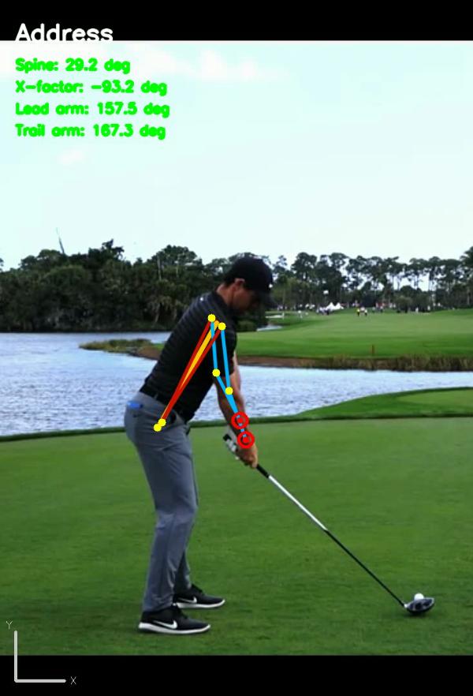

# Golf Swing Analysis using MediaPipe


[](https://www.python.org/)
[](https://opencv.org/)
[](https://mediapipe.dev/)

[](https://github.com/HeleenaRobert/golf-swing-analysis)

A Python project that analyzes golf swings using **MediaPipe Pose**. It extracts body landmarks, detects swing phases, calculates objective metrics, exports structured JSON, and renders annotated videos.

Fork of [HeleenaRobert/golf-swing-analysis](https://github.com/HeleenaRobert/golf-swing-analysis), extended with pose-based metrics and phase detection.

---

## ✨ Features

- Batch-processes all videos in `input/`.
- Extracts pose landmarks (shoulders, arms, hips, knees, wrists, etc.) with **MediaPipe Pose**.
- Detects swing phases: **Address → Takeaway → Top → Impact → Finish**.
- Calculates per-phase metrics (spine angle, X-factor, arm/knee angles, head movement).
- Computes swing tempo with **address hold time** separated from actual backswing.
- Exports structured **JSON** for downstream analysis (e.g. LLM coaching).
- Renders **annotated videos** with skeleton overlay and phase labels.
- Supports **portrait videos** (auto-corrects rotation metadata from iPhone `.mov` files).
- Scales on-screen text and overlays to match video resolution.

---

## 📂 Folder Structure

```
golf-swing-analysis/
│
├── golf_swing_analysis.py      # Entry point
│
├── utils/
│   ├── pose_extractor.py       # MediaPipe pose extraction
│   ├── phase_detector.py       # Swing phase detection
│   ├── metrics.py              # Angle & tempo calculations
│   ├── geometry.py             # Math helpers
│   ├── swing_analyzer.py       # Analysis orchestrator
│   ├── visualizer.py           # Annotated video rendering
│   └── video_utils.py          # Video I/O & rotation handling
│
├── input/                      # Place swing videos here
├── output/
│   ├── swing_data/             # JSON analysis results
│   └── videos/                 # Annotated output videos
│
├── assets/
├── requirements.txt
├── LICENSE
└── README.md
```

---

## 🚀 How It Works

1. Reads all videos from `input/`.
2. Extracts pose landmarks per frame with MediaPipe.
3. Detects swing phases from wrist movement patterns.
4. Calculates metrics and tempo at each phase.
5. Saves JSON to `output/swing_data/`.
6. Renders annotated video to `output/videos/`.

---

## 📄 JSON Output

Each video produces a JSON file with phases, per-phase metrics, and tempo data:

```json
{
  "phases": {
    "address":       { "frame": 5,  "time_sec": 0.17 },
    "takeaway_start":{ "frame": 33, "time_sec": 1.10 },
    "top":           { "frame": 49, "time_sec": 1.64 },
    "impact":        { "frame": 59, "time_sec": 1.97 },
    "finish":        { "frame": 69, "time_sec": 2.30 }
  },
  "tempo": {
    "address_hold_sec": 0.934,
    "backswing_sec": 0.534,
    "downswing_sec": 0.334,
    "follow_through_sec": 0.334,
    "real_tempo_ratio": 1.6
  }
}
```

`takeaway_start` separates idle/waggle time at address from the actual backswing, giving a more accurate tempo ratio for coaching feedback.

---

## 🖼 Sample Output

_(Annotated videos are saved in `output/videos/` as MP4.)_



---

## 🔧 Installation

**Requirements:** Python 3.8+, [ffmpeg](https://ffmpeg.org/) (for portrait video rotation detection via `ffprobe`)

```bash
git clone https://github.com/HarrisonEagle/golf-swing-analysis.git
cd golf-swing-analysis
pip install -r requirements.txt
```

> **Note:** MediaPipe is pinned to `0.10.14–0.10.21` because newer versions removed the legacy `solutions` API used by this project.

---

## ▶️ Usage

1. Place your swing videos in the `input/` folder (`.mp4`, `.mov`, `.avi`, `.mkv`).
2. Run the script:

   ```bash
   python golf_swing_analysis.py
   ```

3. Results are saved automatically:
   - `output/swing_data/<video_name>.json` — analysis data
   - `output/videos/<video_name>_annotated.mp4` — annotated video

---

## 📌 Notes

- Works best with **down-the-line (DTL)** swing videos; face-on angles may reduce phase detection accuracy.
- Phase detection is heuristic-based (wrist position & velocity). Results vary with video length, camera angle, and tracking quality.
- JSON output is designed to be passed to AI tools (e.g. Gemini) for swing coaching feedback.
- Portrait `.mov` files from iPhone require `ffprobe` to read rotation metadata.

---

## 🛠 Technologies Used

- [Python 3.8+](https://www.python.org/)
- [OpenCV](https://opencv.org/)
- [MediaPipe Pose](https://mediapipe.dev/solutions/pose.html)
- [NumPy](https://numpy.org/)
- [ffmpeg / ffprobe](https://ffmpeg.org/)

---

## 📜 License

This project is licensed under the [MIT License](LICENSE).

---

## 👩‍💻 Authors

**Original:** [Heleena Robert](https://github.com/HeleenaRobert)  
**Fork & extensions:** [HarrisonEagle](https://github.com/HarrisonEagle)
